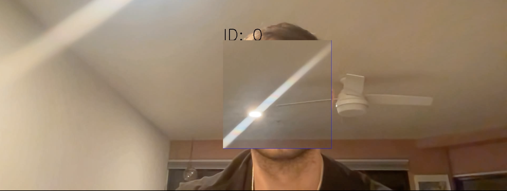

# Python Projects That Don't Suck - Hiding Faces In Images



I see so many python projects across the web. Some are really cool and unique.
Some, on the other hand, are the things we've been seeing for years:

- Building TODO CLI's
- Writing a Survey Application
- Tic-Tac-Toe
- etc.

We've seen all of these projects hundreds of times before. And, don't get me wrong,
if you're new to python they are great projects to get started. But, I come today
with something a bit different which utilizes a whole bunch of cool python features:

- Threads and Queues
- Video Streams
- Array Manipulations

We will take these ideas and wrap them with a nice bow - facial recognition. Our
app is going to find faces in video stream and then replace the face with some
background image (dictated by the end user).

In more depth, the project that we're going to write is an app that will
open our video camera using OpenCV. The video stream will wait for a user to 
select their background image, which will serve as the replacement for when faces
are detected. The app will then begin placing images on a queue, from a background
thread and begin analyzing each frame. If a face is detected, it will replace pixels 
around the face with pixels from our predetermined background image.

## A Buffered Video Reader
Now, you might be wondering 

"Why do I need this background thread and a queue of images?"

That's a valid question! For me, it's actually due to resource constraints on my 
physical laptop. I don't have a GPU or any extra-snazzy hardware.
Because of this, the video streaming and analysis actually take a bit of time and
openCV ends up dropping frames and I get a very jittery video. If I buffer these frames 
from a background thread, I don't miss any frames from my video stream and each 
frame gets analyzed. The result is a smoother video output.

Our buffered video reader needs a few methods:

1. `start`: This method will start the background thread. I like to keep this out
            of my `__init__` method as I believe it makes my code a bit cleaner
            and more explicit. I like to keep most logic out of the `__init__`, 
            but that's just a preference.
2. `read`: This method should read a frame from our queue and return it to the caller.
            If the queue is empty, it should return `None`.
3. `_reader`: This will be our thread's target method. The thread should read frames
             from our CV2 video capture and populate the queue.
4. `process`: This method should perform the actual processing of the frames. It will
              perform any facial detection, draw the bounding boxes, and do the actual
              pixel manipulation.

The entire class can be seen below:

```python
import threading
import queue
import cv2
from deepface import DeepFace
from typing import Union, List, Dict, Tuple, Any
import numpy


class BufferedVideoReader:
    """A Buffered Video Reader

    This class will open up a CV2 VideoCapture
    with the specified name (most likely '0' for
    your local webcam). It then starts a background
    thread to write frames to its queue and will analyze
    them when requested.

    Arguments:
        name (Union[str, int]): The device name, ID, or URL
        detector_backend (str): The DeepFace detector backend
    """

    def __init__(self, name: Union[str, int], detector_backend: str = "opencv"):
        self.detector_backend = detector_backend
        self.cap = cv2.VideoCapture(name)
        self.q = queue.Queue()
        self.count = 0
        self.prev = []

    def start(self):
        """Starts the video buffering thread which
        will run for the lifetime of the program
        """
        t = threading.Thread(target=self._reader)
        t.daemon = True
        t.start()

    def _reader(self):
        """Reads a frame from our video capture and then
        writes it to our queue. Also increments the frame
        count
        """
        while True:
            ret, frame = self.cap.read()
            if not ret:
                break
            self.q.put(frame)
            self.count += 1

    def read(self):
        """Reads a frame from the queue or returns
        None if the queue is empty

        Returns:
            frame (): The frame at the front of the queue
            None: If the queue is empty
        """
        try:
            return self.q.get(block=True, timeout=1)
        except queue.Empty:
            return None

    def get(self, prop: int) -> Union[str, int]:
        """Returns a specific property about our video stream, such
        as FPS, Frame Height, Width, etc.

        Arguments:
            prop (int): The integer id of the property

        Returns:
            property Union[str, int]: The property's value
        """
        return self.cap.get(prop)

    def process(
        self,
        frame: numpy.ndarray,
        replace_with: numpy.ndarray = None,
        threshold: float = 0.80,
    ) -> Tuple[numpy.ndarray, List[Dict[str, Any]]]:
        """Processes a frame and performs any facial replacements.

        This method uses DeepFace to find all of the faces in the
        frame. For each face it finds, it will then draw a bounding
        box around that face and replace the facial pixels with the
        pixels from the background image.

        Arguments:
            frame (numpy.ndarray): The frame to be processed
            replace_with (numpy.ndarray): The frame to use for replacements
            threshold (float): Confidence threshold. Results under this will
                be ignored.

        Returns:
            result ([numpy.ndarray, List[Dict[str, Any]]]): The annotated frame
                as well as the result objects from DeepFace
        """

        # 1. Perform the facial extraction
        res = DeepFace.extract_faces(
            frame,
            enforce_detection=False,
            detector_backend=self.detector_backend,
        )

        # 2. For each face that we found...
        for idx, r in enumerate(res):
            region = r["facial_area"]
            confidence = r["confidence"]

            if confidence < threshold:
                continue

            # 3. Draw the bounding box
            x, y, w, h = region["x"], region["y"], region["w"], region["h"]
            cv2.rectangle(frame, (x, y), (x + w, y + h), (255, 0, 0), 1)
            cv2.putText(
                frame,
                f"ID: {idx}",
                (x, y),
                cv2.FONT_HERSHEY_SIMPLEX,
                2,
                (0, 0, 0),
                2,
            )

            # 4. Replace the pixels in the analyzed frame with the
            #    pixels from the background frame
            if replace_with is not None:
                # Replace the face pixels with the background image
                frame[y : y + h, x : x + w, 0] = replace_with[y : y + h, x : x + w, 0]
                frame[y : y + h, x : x + w, 1] = replace_with[y : y + h, x : x + w, 1]
                frame[y : y + h, x : x + w, 2] = replace_with[y : y + h, x : x + w, 2]
        return frame, res
```

## Invoking The Buffered Video Reader
Now that we have a class that will buffer videos, analyze them,
etc., we just have to call it! So, we need a function which
will:

1. Instantiate a `BufferedVideoReader`
2. Start the `BufferedVideoReader`
3. Allow the user to select a background image
4. Show the analyzed frame to the user

```python
def analyze_video(device=0, show=True, save=True):
    # 1. Create a video capture instance.
    # VideoCapture(0) corresponds to your computers
    # webcam
    cap = BufferedVideoReader(device)

    # Lets grab the frames-per-second (FPS) of the
    # webcam so our output has a similar FPS.
    # Lets also grab the height and width so our
    # output is the same size as the webcam
    fps = cap.get(cv2.CAP_PROP_FPS)
    frame_width = int(cap.get(3))
    frame_height = int(cap.get(4))

    # Now lets create the video writer. We will
    # write our processed frames to this object
    # to create the processed video.
    out = cv2.VideoWriter(
        "outpy.avi",
        cv2.VideoWriter_fourcc("M", "J", "P", "G"),
        fps,
        (frame_width, frame_height),
    )

    cv2.namedWindow("Video")

    # Click Space Bar To Set Your Background Image
    background = None

    # 2. Create a video capture instance.
    cap.start()

    while True:
        # Capture frame-by-frame
        frame = cap.read()
        annotated = None

        if frame is None:
            break

        if background is not None:
            frame, res = cap.process(frame, replace_with=background)

        annotated = frame.copy()

        # 3. Allow the user to select a background image
        if background is None:
            label = "Press Space To Capture Background"
            (diff_x, diff_y), _ = cv2.getTextSize(label, cv2.FONT_HERSHEY_SIMPLEX, 2, 2)
            h, w, _ = frame.shape

            cv2.rectangle(
                annotated,
                ((w - diff_x) // 2, h - 2 * diff_y),
                ((w + diff_x) // 2, h),
                (255, 255, 255),
                -1,
            )
            cv2.putText(
                annotated,
                label,
                ((w - diff_x) // 2, h - diff_y),
                cv2.FONT_HERSHEY_SIMPLEX,
                2,
                (0, 0, 0),
                2,
            )

        # 4. Show the analyzed frame to the user
        cv2.imshow("Video", annotated)
        k = cv2.waitKey(1)
        if k % 256 == 27:
            # ESC pressed
            return True
        elif k % 256 == 32:
            # SPACE pressed
            background = frame

        if save:
            out.write(annotated)
```

Note that we have some extra stuff in there to write an output video, but
that's not super pertinent to the project.

Finally, we can run it and we'll get a nifty video like the below:


If you're running it locally, please note that the live video stream which
pops up on your desktop will be delayed. However, when playing the video back,
it will have the same FPS and specs as your webcam normally would. This is due
to the buffering!